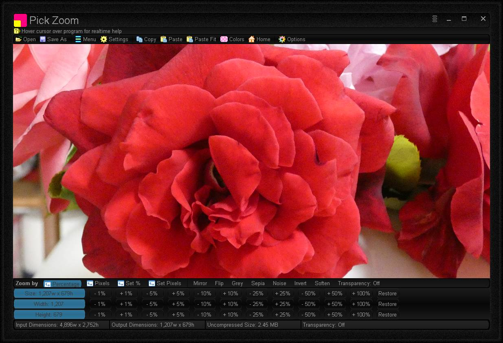

# Pick Zoom
Zoom an image up/down by percentage or pixels, quickly and with ease. WYSIWYG view. Realtime zoomed image dimensions and size.

# Features
* One touch buttons for fast zoom change
* Zoom by: Percentage, Pixels, Set Percentage or Set Pixels
* Copy / Paste / Paste to Fit
* Options: Mirror, Flip, Grey, Sepia, Noise, Invert
* Realtime WYSIWYG (What you see is what you get) visual display for instant graphical feedback
* Standard Image formats: PNG, JPG, GIF and BMP
* Portable
* Options Window - Easily change program color, font and settings

# Download
<a href="src/pickzoom.exe">pickzoom.exe</a> - windows all

# Images

